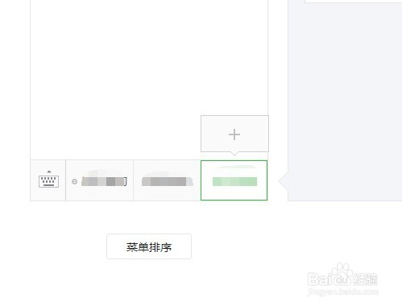
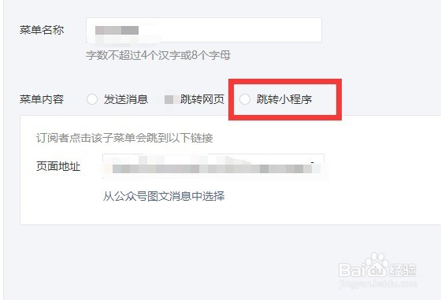
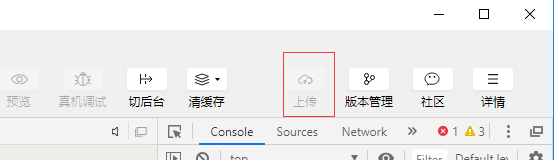
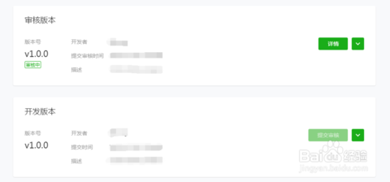
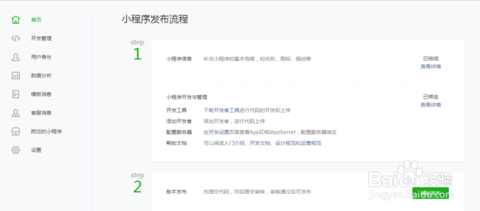

微信登录、跳转小程序

有公众号流程：
  - 管理员手机微信扫描二维码确认；
  - 勾选复用 【公众号信息】【运营者信息】，否则需要重新认证；
  - 需求一个新的邮箱，作为小程序登录账户。 ——> 前往邮箱激活；
  - 管理员扫码确认信息。
  
---------------------------- 申请 end  ----------------------------

小程序支付：复用公众号支付系统，若未开通，需求：
  - 联系人、手机号、邮箱
  - 商户名称、经营类型、
  - 特殊资质（许可证之类）、售卖商品简介、客服电话、【非必须】：公司网址、补充材料
  - 营业执照、
  - 组织机构代码
  - 企业法人、经办人
  - 结算账户
  
备注： 商户账户验证，登录【公众平台】→【微信支付】→【账户验证】。
在线签署协议，登录【商户平台】→【账户设置】→【支付申请】→【签署协议】→【签署】。

 > 如果没有公众号：
 
 > 则需要 - 营业执照注册号：
 
 > 管理员身份证 - 姓名 身份证号 手机号

### 登录

登录步骤：

① 小程序前端使用wx.login() 从微信服务器获取code

② 小程序前端将code 发送给开发者服务器，开发者服务器利用appId、appSecret 和code 向微信服务器换换取用户openId 和session_key

③ 开发者服务器自定义登录态并将其与openId 和session_key 关联起来然后写session

④ 开发者服务器将登录态返回给小程序前端，小程序前端使用wx.setStorageSync() 将登录态保存起来

⑤ 小程序前端在执行业务请求时将登录态发送给开发者服务器，以便开发者服务器知道当前操作的用户是哪位。

也就是说，在整个过程中小程序前端是拿不到用户openId 的，它只能通过开发者服务器发给它的登录态来告诉服务器当前用户的信息。登录过程中涉及session_key 和unionId，于是又引出了下面的问题。

 > 前端 app 调用 wx.login() 接口：

    wx.login(Object object)
    wx.login({
      success (res) {
        if (res.code) {
          //发起网络请求
          wx.request({
            url: 'https://test.com/onLogin',
            data: {
              code: res.code
            }
          })
        } else {
          console.log('登录失败！' + res.errMsg)
        }
      }
    })

 > auth.code2Session # 本接口应在 [ 服务器端 ] 调用
 > GET https://api.weixin.qq.com/sns/jscode2session?appid=APPID&secret=SECRET&js_code=JSCODE&grant_type=authorization_code

        {
          appid: 小程序 appId ——》 来源于 开发者中心
          secret: 小程序 appSecret ——》 来源于 开发者中心
          js_code: 登录时获取的 code
          grant_type: 授权类型，此处只需填写 authorization_code
        }

### 跳转小程序
打开微信公众号 -> 自定义菜单 -> 添加一个子菜单

添加子菜单，右侧可以选择 【 发送消息 | 跳转网页 | 小程序 】
[详情可以跳转到教程页面](https://jingyan.baidu.com/article/86112f13bd1ded27379787ae.html)

 > 数据上报 
 
 [自定义业务数据监控上报接口](https://developers.weixin.qq.com/miniprogram/dev/api/open-api/report/wx.reportMonitor.html):  wx.reportMonitor(string name, number value)
  
  一个监控事件对应唯一的监控ID，开发者最多可以创建128个监控事件。

    wx.reportMonitor('1', 1)

 > 数据分析 
 
 [自定义分析数据上报接口](https://developers.weixin.qq.com/miniprogram/dev/api/open-api/report/wx.reportMonitor.html):  wx.reportAnalytics(string eventName, Object data)
  
  使用前，需要在小程序管理后台自定义分析中新建事件，配置好事件名与字段。
    
    wx.reportAnalytics('purchase', {
      price: 120,
      color: 'red'
    })

微信提供的数据有：

昨日概况： 访问人数、新访问人数、总添加人数、新添加人数

访问趋势

访问分布: 来源、时长、深度

访问留存

访问页面： 次数、人数、次均时长、入口页次数、退出率、分享次数、分享人数

性别及年龄分布

地区分布

终端及机型分布

其他需要埋点数据解决方案，自己提供 json 埋点数据配置信息。
通过监听用户操作，对比配置文件，输出想要的信息。

 - - - - - - - - - - - - - - - - - - - - - - - - - - - - - - - - - - - - - - - -  - - - - - -

开发者工具 -> 上传(右上角) -> 上传(右上角) -> 上传(右上角)

 > 上传需要appID，试用上传功能是禁用状态。

微信公众平台(小程序首页):

 1、填写小程序相关信息及用户身份信息（暂时可绑定5个开发者和10个体验者）
 
 2、“前往发布”按钮，按要求填写小程序相关信息及版本信息即可提交审核。

